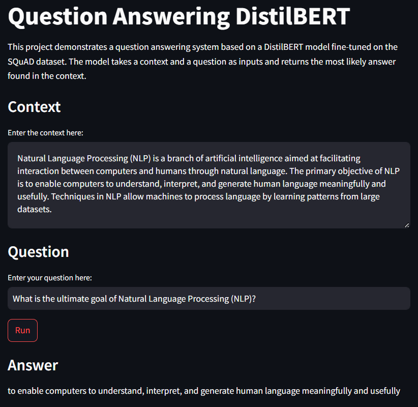

# Question Answering with Fine-Tuned DistilBERT



This project utilizes the DistilBERT model from Hugging Face's Transformers library for question answering. The model has been fine-tuned on the SQuAD dataset and is used to extract the most relevant answer to a given question from a provided context.

## Features

- **User Input:** Users can input a context and a question into the application.
- **Question Answering:** The app will extract and display the most likely answer from the context using the fine-tuned DistilBERT model.
- **Streamlit Integration:** The application is built using Streamlit, providing an interactive web-based interface.

## Installation

### Prerequisites

- Python 3.11 or higher
- Conda or pip for package management

### Setting Up the Environment

1. Create a new Conda environment:

```bash
conda create --name question_answering python=3.11
conda activate question_answering
```

2. Install PyTorch:

#### Using `conda`

##### MacOS

```bash
conda install pytorch==2.3.1 torchvision==0.18.1 torchaudio==2.3.1 -c pytorch
```
##### Windows and Linux

###### CUDA 11.8

```bash
conda install pytorch==2.3.1 torchvision==0.18.1 torchaudio==2.3.1 pytorch-cuda=11.8 -c pytorch -c nvidia
```

###### CUDA 12.1

```bash
conda install pytorch==2.3.1 torchvision==0.18.1 torchaudio==2.3.1 pytorch-cuda=12.1 -c pytorch -c nvidia
```

###### CPU Only

```bash
conda install pytorch==2.3.1 torchvision==0.18.1 torchaudio==2.3.1 cpuonly -c pytorch
```

#### Using `pip`

##### MacOS

```bash
pip install torch==2.3.1 torchvision==0.18.1 torchaudio==2.3.1
```

##### Windows and Linux

###### (ROCM 6.0, Linux only)

```bash
pip install torch==2.3.1 torchvision==0.18.1 torchaudio==2.3.1 --index-url https://download.pytorch.org/whl/rocm6.0
```

###### CUDA 11.8

```bash
pip install torch==2.3.1 torchvision==0.18.1 torchaudio==2.3.1 --index-url https://download.pytorch.org/whl/cu118
```

###### CUDA 12.1

```bash
pip install torch==2.3.1 torchvision==0.18.1 torchaudio==2.3.1 --index-url https://download.pytorch.org/whl/cu121
```

###### CPU only

```bash
pip install torch==2.3.1 torchvision==0.18.1 torchaudio==2.3.1 --index-url https://download.pytorch.org/whl/cpu
```

3. Install `requirements.txt` dependencies:

```bash
pip install -r requirements.txt
```

4. Run the Streamlit application:

```bash
streamlit run app/main.py
```

5. Open your web browser and navigate to `http://localhost:8501` to use the application.
